# Control Center|common/deepin-controlcenter.svg|
## Overview|common/icon_overview.svg|

By Control Center, deepin manages the basic system settings, which includes account management, network settings, date and time, personalization, screen display settings and so on. After logging in deepin desktop environment, the Control Center panel will be opened by only moving the mouse pointer to the lower-right corner of the screen.

On Control Center panel, you can:

- Change the keyboard property
- Adjust system volume.
- Optimize power function.
- Personalize desktop display.
- Change network connection.
- Create new account.
- Change system date and time display.
- Remote assistance.
- Enter shutdown interface.
- Upgrade system and software.

## Guide|common/icon_guide.svg|
Control Center panel is mainly composed of system administrator account, system basic settings and power button.

> : Please refer to [Open Launcher and Control Center](dman:///deepin-system#[Open Launcher and Control Center] and [Boot and shutdown](dman:///deepin-system#Boot Up and Shutdown) for specific operations of open/exit Control Center and power display interface.

  
  
 <table class="block1">
     <caption>Icon Description</caption>
     <tbody>
     <tr>
            <td></td>
            <td>Click to create or manage, or execute other operations to account. </td> 
            <td></td>
            <td>Click to set the resolution, brightness and others of the screen. </td>
         </tr>
          <tr>
            <td></td>
            <td>Click to set default startup applications. </td>
            <td></td>
            <td>Click to set theme, window, icon, cursor, wallpaper and font. </td>
         </tr>
           <tr>
            <td></td>
            <td>Click to set network. </td>
            <td></td>
            <td>Click to set speaker and microphone. </td>
         </tr>
         <tr>
            <td></td>
            <td>Click to set date and time. </td>
            <td></td>
            <td>Click to set power. </td>
         </tr>
         <tr>
            <td></td>
            <td>Click to set mouse and touchpad. </td>
            <td></td>
            <td>Click to set keyboard layout and language. </td>
         </tr>
         <tr>
            <td></td>
            <td>Click to set system shortcuts. </td>
             <td></td>
            <td>Click to visit and control other computers remotely through network to execute operations. </td> 
         </tr>
             <tr>
           <td></td>
            <td>Click to set default boot menu. </td>
            <td></td>
            <td>Click to view system detailed information and upgrade system and software. </td>            
         </tr>
         </tbody>
 </table>

## Account Settings|common/icon_account.svg|

By setting account, provide safety guarantee to your computer, protect your privacy and data.

### Auto-login
You can enable auto-login to automatically log in system with the account after booting each time. 

  

1. On Control Center panel, click on **Account**.
2. Select the account to set, drag the **Auto-login** button rightwards to enable auto-login function.
3. On the pop-up authentication interface, input your account password to authorize the operation.

### Change Account Avatar

 You can personalize your avatar by the following ways.

- Use built-in account avatar.
- Use your favorite image as account avatar.
- Use photo taken by camera as account avatar.

  
  
1. On Control Center panel, click on **Account**.
2. Select the account that needs to change avatar, you can:
 - Click on **Avatar**, select an avatar you like to change.
 - Click on **Webcam**, use built-in or external camera to take a photo and use as avatar.
 - Click on, select other images stored in the computer to set as account avatar.
3. On the pop-up authentication interface, input your account password to authorize the operation.

### Change Account Password

The system will notify you to set a default account password during its installation. After logging in, you can change the default account password.

1. On Control Center panel, click on **Account**.
2. Select the account to change password, in **Password** option, click on ••••.
3. Input a new password and confirm it.
4. Click on **Confirm**.

  

### Create New Account
After logging in, you can create a new account and switch users while using.

1. On Control Center panel, click on **Account**.
2. Click on .
3. Input user name and password and confirm the password.
4. Select account type.
5. If you want to enable auto-login, please drag the **Auto-login** button rightwards.
6. Click on **Confirm**, the new account will automatically be added into account list.

  

> : You can log in the computer as administrator, normal user or guest.

- **Administrator:** Fully permitted to control the computer, can make changes to the computer and have access to all the files in the computer.
- **Normal User:** Have access to programs installed in the computer, but restricted when executing other operations to the computer.
- **Guest:** Can view the programs installed in the computer, but can not makes changes to computer files or applications.

## Display Settings|common/icon_display.svg|

By setting the resolution, brightness, rotation of the monitor and extending the screen to optimize your computer display.

### Single Screen Settings
You can adjust the visual perception by setting the screen resolution, brightness and so on.

#### Setting Resolution
1. On Control Center panel, click on **Display**.
2. In **Resolution** collapse box, select the resolution to switch.
3. Click on **Apply**.

 

#### Set Rotation
1. On Control Center panel, click on **Display**.
2. In **Rotation** collapse box, select the displaying orientation for desktop screen.
3. Click on **Apply**.

 

#### Set Brightness
1. On Control Center panel, click on **Display**.
2. In **Brightness** option, drag the button leftwards/rightwards to adjust screen brightness.

 

### Multi-Screen Settings
Multi-screen display, boundlessly extend your vision.

With VGA cable, you can connect your computer to another monitor, projector and others. The contents in your computer can be displayed simultaneously on multiple screens. 

#### Set Display Mode
By setting display mode, you can choose to display screen contents on one screen or multiple screens.
 
1. On Control Center panel, click on **Display**.
2. In **Display Modes** collapse box, you can:
  - Select **Copy** to copy the contents from one screen to another.
  - Select **Extend** to extend the screen contents to display different contents on different screens.
  - Select **Display On LVDS Only** to display screen contents only on LVDS display device rather than other screens. 
  - Select **Display On VGA-0 Only** to display screen contents only on VGA-0 display device rather than other screens.

 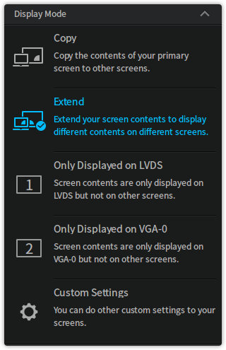

> : To cancel Copy display mode, please click on **Custom Settings** > **Split**. In Extend display mode, click on **Custom Settings** > **Edit** to drag display devices to change the display position as you like.

#### Custom Settings
You can set the other options in multi-screen display mode.

1. On Control Center panel, click on **Display**.
2. Click on **Custom Settings**, you can:
  - Click on **Enable Monitor(s)** to select display device(s) to use.
  - Click on **Primary Screen** to select primary display device to use.
  - Click on **Resolution** to set the resolution of the display device.
  - Click on **Rotation** to set the screen orientation of the display device.
  - Click on **Brightness** to set the brightness of the display device.

 

#### Identify Multiple Monitors
When connected to multiple monitors, if you already set the display mode to Copy or Extend, then you can distinguish each display devices by identify function.

1. On Control Center panel, click on **Display**.
2. Click on **Identify**, and then on each screen you will see the names of relevant display devices.

 

## Default Application Settings|common/icon_defaultapp.svg|
### Default Startup Settings
When multiple application of the same type are installed in the system. You can select one of them to be the default startup application.

 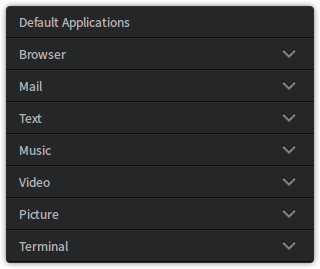

1. On Control Center panel, click on **Default Applications**.
2. In **Default Applications** option, you can:
  - Click on **Browser** to select default browser.
  - Click on **Mail** to selet default mail client.
  - Click on **Text** to select default text editor.
  - Click on **Music** to select default music player.
  - Click on **Video** to select default video player.
  - Click on **Picture** to select default image editor.
  - Click on **Terminal** to select default terminal tool.

### Autoplay Settings
If autoplay is enabled, then the computer will automatically execute further operations when you insert media storage devices such as DVD.

 

1. On Control Center panel, click on **Default Applications**.
2. Drag **Autoplay** button rightwards to enable autoplay.
3. In **Autoplay** option, you can set default operations for media files and software.

## Personalization|common/icon_personalization.svg|
You can change the appearance of the desktop to your favorite style by using different wallpapers, icons, window types and so on.

### Theme Settings

1. On Control Center panel, click on **Personalization**.
2. In **Theme** collapse box, you can:
  - Use system default theme.
  - Use custom theme.
  - Hover the mouse pointer over the theme, click on  in the upper-right corner, you can preview the theme.

 

> : If you want to use customized theme, please set the window, icon, cursor, wallpaper and font respectively.

### Window Settings

1. On Control Center panel, click on **Personalization**.
2. In **Window** collapse box, select a window type to switch.

 

### Icon Settings
1. On Control Center panel, click on **Personalization**.
2. In **Icon** collapse box, select a icon type to switch.

 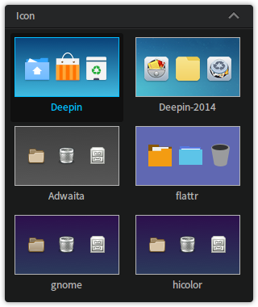

### Cursor Settings
1. On Control Center panel, click on **Personalization**.
2. In **Cursor** collapse box, select a cursor type to switch.

 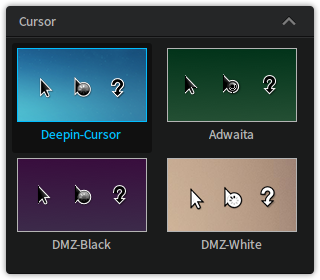

### Wallpaper Settings

#### Built-in Wallpaper
There are some different built-in wallpapers in the system, you can select your favorite wallpaper to switch.

1. On Control Center panel, click on **Personalization**.
2. In **Wallpaper** collapse box, select a wallpaper to switch.

 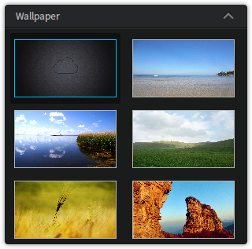
 
#### Acquire External Image
You can set your favorite image as wallpaper.

1. Open externally acquired image, right-click mouse button and select **Set as Wallpaper**.
2. Wallpaper will automatically be switched to current image and display.
3. To delete external wallpaper, call out Control Center and click on **Personalization** > **Wallpaper**.
4. Click on the button in the upper-right corner of the image to delete.

 

### Font Settings

1. On Control Center panel, click on **Personalization**.
2. In **Fonts** collapse box, set the type and size of the font displayed in the system.
 
 

## Network Settings|common/icon_network.svg|

Experience the fun surfing the Internet!

You can browse news, play online video, download files, chat with friends, shop online and so on.

### View Network
You can view the status and detailed information of the current computer network.

 

1. On Control Center panel, click on **Network**.
2. If  is in front of the network name which you want to connect to, then the current computer is already connected to the network.
3. Click on  to view the detailed information of the currently selected network. 
4. Click on  in the upper-right corner to view the detailed information of all the connected network.
5. To exit the detailed information interface, please click on **Cancel**.

### Create New Network
You can connect to network by dial-up Internet connection or VPN connection to access Internet.

 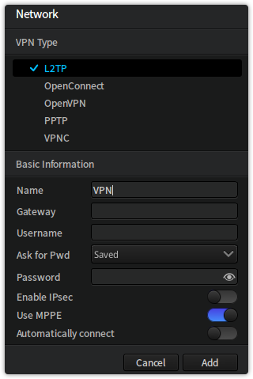

1. On Control Center panel, click on **Network**.
2. Click on .
3. Select network type.
4. Click on **Next**.
5. Input username, password and so on.
6. Click on **Add**.

### Connect to Network
You can connect the computer to router or network port by wire to access wired network. If your computer is equipped with wireless device, you can search for the known wireless network to access.

#### Connect to Wired Network

1. Plug the wire in the network port on the computer.
2. Plug the other end of the wire in a router or network port.
3. On Control Center panel, click on **Network**.
4. Drag **Wired Network** button rightwards to enable wired network function.
5. After successfully connected to network, a prompt message of "Connected Wired Connection" will be displayed on the desktop.

  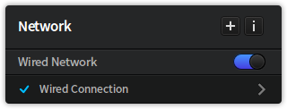

#### Connect to Wireless Network 

- WLAN card has been built in most laptops, you only need to enable it to connect to wireless network.
- WLAN card is not built in most desktop computers, you can purchase one and insert it to the computer if needed. The computer will automatically identify the wireless device.

 

1. On Control Center panel, click on **Network**.
2. Drag **Wireless Network** button rightwards to enable wireless network function.
3. The computer will automatically search for available wireless network nearby.
4. Select wireless network to connect:
 - If the network is open, then it will be automatically connected.
 - If the network is encrypted, then you should input password according to hint, click on **Save**, then it will be automatically connected.

#### Delete Wireless Network
You can delete the unnecessary network from the list.

1. On Control Center panel, click on **Network**.
2. Select wireless network to delete, click on .
3. Click on **Delete this network**, a prompt message of "Are you sure you want to delete this network?" will display. 
4. Click on **Delete**.

 

### Enable Network Auto-Connection
After connected to wired or wireless network, you can enable auto-connection, so the computer will be automatically connected to the network when you log in next time.

1. On Control Center panel, click on **Network**.
2. Select wireless network to auto-connect, click on .
3. Drag **Automatically connect** button rightwards to enable auto-connection.
4. Click on **Save**.

 

### Manually Configure IP Address
You can manually configure IP Address in both wired and wireless network.
 
1. On Control Center panel, click on **Network**.
2. Select network to configure, click on .
3. Click on **IPv4** or **IPv6**.
4. In the pull-down option of **Method**, select **Manual**.
5. Input IP address, netmask, gateway and DNS server.
6. Click on **Save**.

 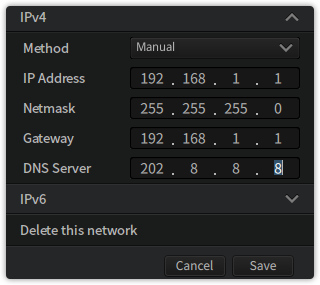

### Network Proxy Settings
You can breakthrough network limitations by setting proxy server, which makes your network unblocked.

1. On Control Center panel, click on **Network**.
2. Click on **System Proxy**, you can:
  - Click on **None** to disable proxy server function.
  - Click on **Manual** to input proxy server address and port information.
  - Click on **Auto** and input URL, the system will automatically configure the information of proxy server.
3. Click on **Apply system wide**.

 

## Sound Settings|common/icon_sound.svg|
You can adjust system volume by executing one of the following operations:

- Move the mouse pointer to  and drag the volume slider.
- On Dock, click on  or  > **sound** to enter Control Center to set sound.
- Use volume control that is built in the application to set.

### Speaker Settings
Nowadays, computers usually have built-in speakers. You can listen to the player without an external speaker or earphone.

1. On Control Center panel, click on **Sound**.
2. Drag the **Speaker** button rightwards to enable speaker.
3. Drag the slider leftwards/rightwards to adjust output volume and left/right balance.

 

### Microphone Settings
Normally, a microphone have been built in the computer system, and can be used to make recordings or talk to others.

1. On Control Center panel, click on **Sound**.
2. Slide **Microphone** rightwards to enable microphone.
3. Drag the slider leftwards/rightwards to increase/decrease input volume.

 

### Advanced Settings
You can make more detailed settings to input and output in advanced setting options.

1. On Control Center panel, click on **Sound**.
2. Click on **Show Advanced**.
3. Set the port and devices for input and output.

 

## Date and Time|common/icon_dateandtime.svg|
System has made initialize settings for date and time, you can check if the date and time is correct on Dock.

### View Date and Time
- In Fashion mode, time will be displayed on Dock as . Move the mouse pointer to  to view date.
 
 

- In Efficient or Classic mode, time will be displayed on the right side of the Dock as . Move the mouse pointer to  to view date.

 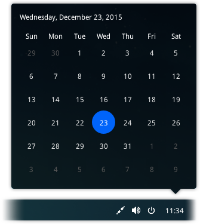

> : Click or right-click on Time > **Time settings** to open Control Center panel to set date and time.

### Switch Display Mode
- In Fashion mode, right-click on  > **Switch display mode**, time will display as .

- In Efficient or Classic mode, right-click on  > **Display date** or **Display week** to display on Dock the date or day.

### Display 24-hour Clock
24-hour clock is different from 12-hour clock. In 24-hour clock, 1:00 p.m. is 13:00.

1. On Control Center panel, click on **Date and Time**.
2. Drag **Use 24-hour clock** button rightwards to enable 24-hour clock function.

 

### Auto-Sync
Enabling auto-sync function will allow the computer to automatically acquire time from Internet and synchronously update time based on your region or location.

1. On Control Center panel, click on **Date and Time**.
2. Drag **Sync Automatically ** button rightwards to enable auto-connection.

 

### Manual Settings
You can manually set time according to to other time tools around you, such as timepiece, official time and so on.

>  : You can not manually change date and time when the function of "Sync Automatically" is enabled.

#### Time Settings

1. On Control Center panel, click on **Date and Time**.
2. Double click Time in the top display frame, you can:
  - Click on  and  to correct time.
  - Manually input numbers to change time.
3. Click on **Save** to complete time change.

 

#### Date Settings

1. On Control Center panel, click on **Date and Time**.
2. In **Date** option, click on  and  to change year and month.
3. Use the mouse to select date.
4. Click on .
5. Click on **Confirm** to complete date change.

 

#### Time Zone Settings
Usually, if the system is installed with simplified Chinese, then the default time is Beijing Time. If you are in other countries or regions and need to set your computer to local time. You can add the local time zone.

1. On Control Center panel, click on **Date and Time**.
2. In **Time zone** option, you can:
  - Click on  and select a time zone in the list to add and click on **Add**.
  - Click on  and select a time zone to delete and click on **Done**.

 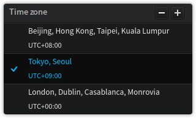

## Power Management|common/icon_powermanagement.svg|
It will provide strong power for your work and entertainment to configure power management protocols. 

### Power Button Operation
When you press the power button, the computer will execute the next operation automatically.

 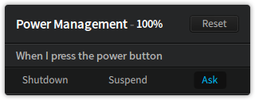

1. On Control Center panel, click on **Power Management**.
2. In **When I press the power button** option, you can:
  - Select **Shutdown**, then when you press power button, the system will shut down.
  - Select **Suspend**, then when you press power button, the system will suspend.
  - Select **Ask**, then when you press power button, the system will ask for your operation.

If you use laptop, you can set the operation when close the lid.

 

1. On Control Center panel, click on **Power Management**.
2. In **When I close the lid** option, you can:
  - Select **Shutdown**, then when you close the lid, the system will shut down.
  - Select **Suspend**, then when you close the lid, the system will suspend.
  - Select **Nothing**, then when you close the lid, the system will do nothing.

### Wake Up Operation
Enable wake-up password to protect your personal files.

 

1. On Control Center panel, click on **Power Management**.
2. Drag **Password require to wake up** rightwards to enable wake-up password function.

### Power Conservation Operation
Set and optimize power to make your work and entertainment last longer.

 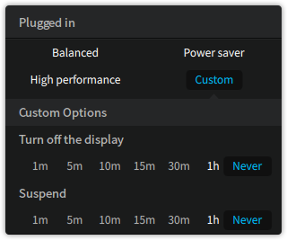

1. On Control Center panel, click on **Power Management**.
2. In **Plugged in** option, you can:
  - Select **Balanced**, the computer will shutdown the monitor when unused for 10 minutes to conserve power.
  - Select **Power saver**, the computer will shutdown the monitor when unused for 5 minutes, and will suspend when unused for 15 minutes.
  - Select **High performance**, the computer will provide its complete performance when needed, and will shutdown the monitor when unused for 15 minutes.
  - Select **Custom**, you can create and customize the time to shutdown the monitor and suspend the system.

If you use laptop, you can set use mode for the laptop battery to optimize the use.

 

1. On Control Center panel, click on **Power Management**.
2. In **On battery** option, you can:
  - Select **Balanced**, the computer will shutdown the monitor when unused for 10 minutes to conserve power.
  - Select **Power saver**, the computer will shutdown the monitor when unused for 5 minutes, and will suspend when unused for 15 minutes.
  - Select **High performance**, the computer will provide its complete performance when needed, and will shutdown the monitor when unused for 15 minutes.
  - Select **Custom**, you can create and customize the time to shutdown the monitor and suspend the system.

## Mouse and Touchpad|common/icon_mouse.svg|

You can set mouse and use touchpad to operate the computer based on your habit.

> : If you use a desktop computer, in Control Center panel it only displays **Mouse**. If you use a laptop, in Control Center panel it displays **Mouse and Touchpad**.

### Mouse Settings
You can adjust the mouse sensitivity based on your habit in daily use.

1. On Control Center panel, click on **Mouse and Touchpad**.
2. In **Primary Button** option, click **Left Button** or **Right Button** to switch to left/right button as primary.
3. In **Pointer Speed** option, drag the slider leftwards/rightwards to adjust the pointer moving speed.
4. In **Double-click Speed** option, drag the slider leftwards/rightwards to adjust the button double-click speed.

 

### Disable the Touchpad 

> : If you enable the function, operation on touchpad will be disabled, all settings made to touchpad will be invalid.

1. On Control Center panel, click on **Mouse and Touchpad**.
2. Drag **Disable the touchpad when inserting the mouse** button rightwards to disable the function of touchpad.
3. Drag **Touchpad** button leftwards to disable the function of touchpad.

 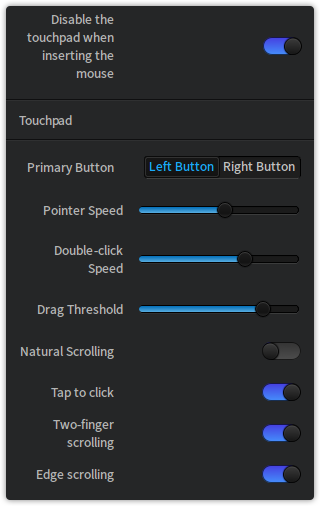

### Enable Touchpad
If you use a laptop, you can use touchpad on the computer instead of mouse.

>: Only when **Disable the touchpad when inserting the mouse** is disable then the operation to enable touchpad can work.

1. On Control Center panel, click on **Mouse and Touchpad**.
2. Drag **Touchpad** button rightwards to enable the function of touchpad.

#### Touchpad Settings

1. On Control Center panel, click on **Mouse and Touchpad**.
2. In **Primary Button** option, click **Left Button** or **Right Button** to switch to left/right button as primary.
3. In **Pointer Speed** option, drag the slider leftwards/rightwards to adjust the touchpad pointer moving speed.
4. In **Double-click Speed** option, drag the slider leftwards/rightwards to adjust the touchpad button double-click speed.
5. In **Drag Threshold** option, drag the slider leftwards/rightwards to adjust the range of the touchpad pointer moving speed.

 

#### Touchpad Scroll Settings

1. On Control Center panel, click on **Mouse and Touchpad**.
2. Drag ** Natural Scrolling ** button rightwards to enable natural scrolling.
3. Drag **Tap to click ** button rightwards to enable tap clicking.
4. Drag ** Two-finger scrolling ** button rightwards to enable two-finger scrolling.
5. Drag ** Edge scrolling ** button rightwards to enable Edge scrolling.

Description for touchpad scrolling is as the following:

- **Natural Scrolling:** Two finger move up/down on the touchpad, the page content will move up/down along with it.
- **Tap to click:** Tap on the touchpad to click.
- **Two-finger scrolling:** Two finger move up/down on the touch pad to scroll.
- **Edge scrolling:** You can execute scroll operation at the edge of the touchpad.

## Keyboard and Language|common/icon_keyboardandlanguage.svg|
Based on your nationality and region, you can select your keyboard input habit and layout.

### Enable Caps Lock Notification
Enable Caps Lock notification to notify you when you press Caps Lock to avoid typo.

1. On Control Center panel, click on **Keyboard and Language**.
2. Drag **Caps Lock prompt" rightwards to enable Caps Lock notification function.

 

### System Language Settings
While installing the system, you can select system default display language. After logging in, you can change the default account password.

1. On Control Center panel, click on **Keyboard and Language**.
2. In **Language** collapse box, the language currently displayed in the system will have a  in front of it.
3. Select language to switch, the system will automatically start installing language packages.
4. After completing language package, a notification will pop up and say "System language has been changed, please log in after log out".
5. Log out and log in again, and the displaying language has been changed.

 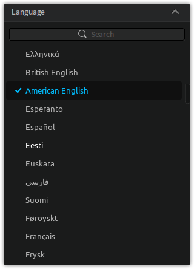

> : When system language is changed, the keyboard layout might also change. When log in again, please make sure to use the right keyboard layout to input password.

### Keyboard Layout Settings

The system default keyboard layout is US keyboard, you can add other keyboard layouts.

#### Add Keyboard Layout

 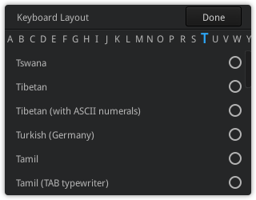

1. On Control Center panel, click on **Keyboard and Language**.
2. In **Keyboard Layout** option, click on .
3. In keyboard layout list, select keyboard layout to add.
4. Click on **Done**.
5. To delete keyboard layout, in **Keyboard Layout** option, click on .

#### Switch Keyboard Layout
1. On Control Center panel, click on **Keyboard and Language**.
2. In **Keyboard Layout ** option, select a keyboard layout to switch.
3. After successfully switched keyboard layout,  will be displayed in front of the current keyboard layout.

 

### Keyboard Settings

1. On Control Center panel, click on **Keyboard and Language**, you can:
   - In **Repeat Delay** option, drag the slider leftwards/rightwards to adjust the interval between two characters.
   4. In **Repeat Rate** option, drag the slider leftwards/rightwards to adjust the emerging rate of characters.
   - In **Cursor Blink Rate** option, drag the slider leftwards/rightwards to adjust the cursor blink rate.
2. In **Test Area**, you can test the keyboard effect in real time.

 

## Shortcuts Settings|common/icon_shortcuts.svg|
Use shortcuts wisely to save your valuable time.

### View Shortcuts
You can not only view all the system default shortcuts, but also change, delete or customize shortcuts.

1. On Control Center panel, click on **Keyboard Shortcuts**.
2. Click on **System**, **Window** and **Workspace**, the shortcuts for system, window and workspace are displayed in the relevant collapse box.

<table class="block1">
    <caption>System Shortcuts</caption>
    <tbody>
        <tr>
            <td>Launcher</td>
            <td>Super</td>
        </tr>
        <tr>
            <td>Show desktop</td>
            <td>Super+D</td>
        </tr>
        <tr>
            <td>Lock screen</td>
            <td>Super+L</td>
        </tr>
         <tr>
            <td>File manager</td>
            <td>Super+E</td>
        </tr>
        <tr>
            <td>Switch applications</td>
            <td>Alt+Tab</td>
        </tr>
        <tr>
            <td>Reverse switch applications</td>
            <td>Shift+Alt+Tab</td>
        </tr>
        <tr>
            <td>3D switch applications</td>
            <td>Super+Tab</td>
        </tr>
        <tr>
            <td>3D reverse switch applications</td>
            <td>Shift+Super+Tab</td>
        </tr>
              <tr>
            <td>Show/Hide the dock</td>
            <td>Super+H</td>
        </tr>
        <tr>
            <td>Screenshot</td>
            <td>Control+Alt+A</td>
        </tr>
        <tr>
            <td>Full screenshot</td>
            <td>Print</td>
        </tr>
         <tr>
            <td>Window screenshot</td>
            <td>Alt+Print</td>
        </tr>
        <tr>
            <td>Delay screenshot</td>
            <td>Control+Print</td>
        </tr>
        <tr>
            <td>Terminal</td>
            <td>Control+Alt+T</td>
        </tr>
        <tr>
            <td>Terminal Quake Window</td>
            <td>F4</td>
        </tr>
        <tr>
            <td>Logout</td>
            <td>Control+Alt+Delete</td>
        </tr>
        <tr>
            <td>Disable the touchpad</td>
            <td>None</td>
        </tr>
        <tr>
            <td>Switch Layout</td>
            <td>Super+Space</td>
        </tr>
    </tbody>
 </table>
<table class="block1">
    <caption>Window Shortcuts</caption>
    <tbody>
        <tr>
            <td>Close window</td>
            <td>Alt+F4</td>
        </tr>
        <tr>
            <td>Maximize window</td>
            <td>Control+Super+Up</td>
        </tr>
        <tr>
            <td>Restore window</td>
            <td>Control+Super+Down</td>
        </tr>
         <tr>
            <td>Minimize window</td>
            <td>Control+Alt+0</td>
        </tr>
        <tr>
            <td>Move window</td>
            <td>Alt+F7</td>
        </tr>
        <tr>
            <td>Resize window</td>
            <td>Alt+F8</td>
        </tr>
        <tr>
            <td>Switch furl state</td>
            <td>Control+Alt+5</td>
        </tr>
        <tr>
            <td>Activate window menu</td>
            <td>Alt+Space</td>
        </tr>
    </tbody>
 </table>
 
 <table class="block1">
    <caption>Workspace Shortcuts</caption>
    <tbody>
        <tr>
            <td>Switch to workspace 1</td>
            <td>Control+1</td>
        </tr>
        <tr>
            <td>Switch to workspace 2</td>
            <td>Control+2</td>
        </tr>
        <tr>
            <td>Switch to workspace 3</td>
            <td>Control+3</td>
        </tr>
         <tr>
            <td>Switch to workspace 4</td>
            <td>Control+4</td>
        </tr>
        <tr>
            <td>Switch to left workspace</td>
            <td>Control+Alt+Left</td>
        </tr>
        <tr>
            <td>Switch to right workspace</td>
            <td>Control+Alt+Right</td>
        </tr>
        <tr>
            <td>Switch to upper workspace</td>
            <td>Control+Alt+Up</td>
        </tr>
        <tr>
            <td>Switch to lower workspace</td>
            <td>Control+Alt+Down</td>
        </tr>
              <tr>
            <td>Move to workspace 1</td>
            <td>Control+Alt+1</td>
        </tr>
        <tr>
            <td>Move to workspace 2</td>
            <td>Control+Alt+2</td>
        </tr>
        <tr>
            <td>Move to workspace 3</td>
            <td>Control+Alt+3</td>
        </tr>
         <tr>
            <td>Move to workspace 4</td>
            <td>Control+Alt+4</td>
        </tr>
        <tr>
            <td>Move to left workspace</td>
            <td>Shift+Control+Alt+Left</td>
        </tr>
        <tr>
            <td>Move to right workspace</td>
            <td>Shift+Control+Alt+Right</td>
        </tr>
        <tr>
            <td>Move to upper workspace</td>
            <td>Shift+Control+Alt+Up</td>
        </tr>
        <tr>
            <td>Move to lower workspace</td>
            <td>Shift+Control+Alt+Down</td>
        </tr>
    </tbody>
 </table>

### Search Shortcuts
You can quickly find the shortcut you need by search function.

1. On Control Center panel, click on **Keyboard Shortcuts**.
2. Input keywords in the search box at the top, all shortcut(s) containing the keywords will be listed in the search bar.

 

### Change Shortcuts
You can use system default shortcut settings or customize shortcuts based on your habit.

1. On Control Center panel, click on **Keyboard Shortcuts**.
2. Click on shortcuts to change.
3. Input new shortcut with keyboard.
4. To disable shortcuts, please press  or .

### Add Shortcuts
Customize more shortcuts to simplify your operations.

1. On Control Center panel, click on **Keyboard Shortcuts**.
2. In **Custom** option, click on .
3. Input shortcut name and command.
4. Click on **Add**.
5. To delete shortcut, please click on .

 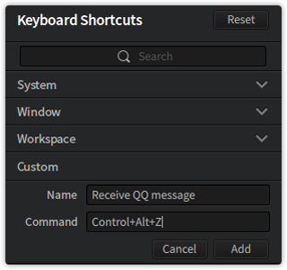

## Remote Assistance Settings|common/icon_remoteassistance.svg|

With remote assistance, you can assist user and technicians to solve problems, in addition, you can do remote assist work, training, interactive teaching and learning, and so on.

 

### Share Operations
When you are seeking for online help or problem solution, you can initiate the share function of remote assistance to share your desktop for the controlling terminal to operate.

 

1. On Control Center panel, click on **Remote Assistance**.
2. On Remote Assistance interface, click on **Share**.
3. System will automatically generate a verification code.
4. Click on **Copy Code** to send the verification code to the controlling terminal.

> : The verification code generated by the system is randomly allocated. If the controlling terminal did not use the verification to access the system for a long time, the verification code will become invalid and you need to regenerate a new verification code.

### Access Operations

If an other party requires for remote assistance, with the verification code of the other party, you can access and control the desktop of the other party.

 
 
1. Acquire the verification code of the controlled terminal.
2. On Control Center panel, click on **Remote Assistance**.
3. On Remote Assistance interface, click on **Access**, then manually input or paste the verification code.
4. Click on **Connect** to access the controlled terminal. Then you can help to solve problem or do other operations.

### Remote Connection

After successfully connection, the system will access the remote desktop of the other party, you can execute control operations to the desktop. Meanwhile, you can set the display effect of the remote desktop.

 

After successfully connected to remote desktop, click on **Preference** collapse menu, you can:

 - Select **Balance**, the remote desktop will be in balance status.
 - Select **Optimize Speed** to optimize the network speed of remote assistance.
 - Select **Optimize Quality** to optimize the displaying image quality of the remote desktop.
 - Select **Fullscreen** to switch to fullscreen mode and makes it easier for you to execute remote operations.

### Disconnect

When remote control operations are complete, you can disconnect with a button in the remote desktop.

 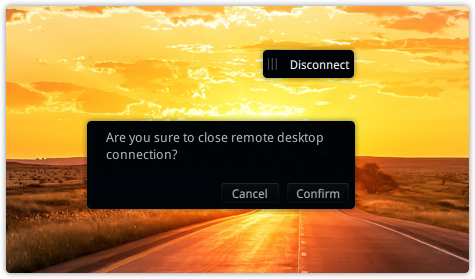

1. Click on **Disconnect**, the system will notify you to make sure if you want to disconnect with remote desktop.
2. Click on **Confirm** to end this remote assistance operation.

> : If the network is interrupted for other reasons while you are operating a remote desktop. The system will automatically disconnect after a while.

## Boot Menu Settings|common/icon_bootmenu.svg|
Multiple system means multiple choices, boot menu makes your system boot vividly.

### Default Boot Settings
When multiple operating system are installed in the computer, you can set a default system to run when the computer startups.

 

1. On Control Center panel, click on **Boot Menu**.
2. In **Default Boot** collapse box, select a default system to run when startup the computer.

### Boot Delay Settings
Delay the system boot for you to execute other operations.

 

1. On Control Center panel, click on **Boot Menu**.
2. In **Boot delay** collapse box, set the boot delay time.

### Boot Background Settings
In Control Center, you can change the background on startup interface.

 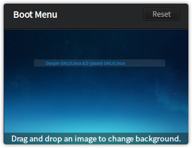

1. On Control Center panel, click on **Boot Menu**.
2. Drag and drop the image to use into the preview window to change the background.

### Boot Interface Text Color Settings
You can set different color for the texts on the boot interface to distinguish one from another.

 

1. On Control Center panel, click on **Boot Menu**.
2. In **Boot Menu** collapse box, you can:
  - Click on **Text Color** to set color for the non-running operating system on the boot interface.
  - Click on **Selected Text Color** to set color for the default operating system on the boot interface.

## System Information|common/icon_systeminfo.svg|
You can view system edition, computer hardware and other information.

1. On Control Center panel, click on **System Information**.
2. In **System Information** option, you can:
  - View the edition of the current operating system.
  - View if it is a 64bit/32bit system.
  - View the CPU model.
  - View the size of the memory.
  - View the volume of the disk.
  - View GNU General Public License.

 
